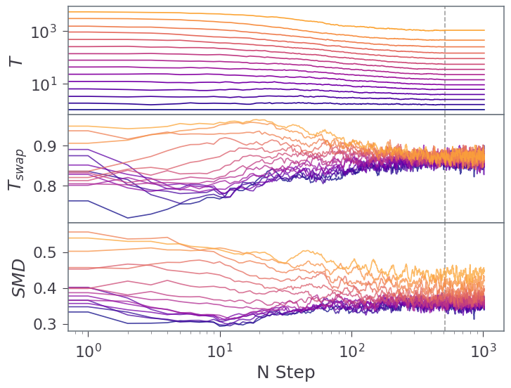
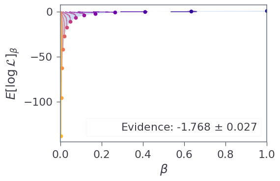

```python
from IPython.display import Image, display
import numpy as np
import reddemcee
np.random.seed(1234)
```

# Evidence

We will start with a simple 2D gaussian shell evaluation:
- Widely used in the literature (vg, dynesty and multinest papers, as well as Vousden and Lartillot&Philippe 2009)
- It is analytically tractable.

## Constants
In the following section we will define the relevant constants to the problem, similarly to the Quickstart section.


```python
ndim_ = 2  # n dimensions
r_ = 2.  # radius
w_ = 0.1  # width
hard_limit = 6  # hard search boundary

limits_ = [-hard_limit,  hard_limit]
c1_ = np.zeros(ndim_)
c1_[0] = -3.5
c2_ = np.zeros(ndim_)
c2_[0] = 3.5
const_ = np.log(1. / np.sqrt(2. * np.pi * w_**2))
```


```python
def logcirc(theta, c):
    # log-likelihood of a single shell
    d = np.sqrt(np.sum((theta - c)**2, axis=-1))  # |theta - c|
    return const_ - (d - r_)**2 / (2. * w_**2)


def loglike(theta):
    # log-likelihood of two shells
    return np.logaddexp(logcirc(theta, c1_), logcirc(theta, c2_))


def logprior(theta):
    # prior for our parameters
    lp = 0.
    for i in range(ndim_):
        if  theta[i] <= limits_[0] or limits_[1] <= theta[i]:
            return -np.inf
    return lp
```

And some plot utilities to visualize our results:


```python
def plot_betas_ratios(sampler, setup):
    bh = sampler.betas_history
    rh = sampler.ratios_history

    fig, axes = pl.subplots(2, 1, figsize=(9, 5), sharex=True)

    bh1 = bh.reshape((setup[2], setup[0]))
    rh1 = rh.reshape((setup[2], setup[0]-1))

    for i in range(setup[0]-2):
            bh_sel = bh1[:, i]
            b = 1/np.array(bh_sel)
            axes[0].plot(np.arange(setup[2])*setup[3], b)
            axes[0].set_xscale('log')
            axes[0].set_yscale('log')


    for i in np.arange(setup[0]-1):
        r = rh1[:, i]
        axes[1].plot(np.arange(setup[2])*setup[3], r, alpha=0.5)

    if True:
        axes[1].set_xlabel("N Step")
        axes[0].set_ylabel(r"$\beta^{-1}$")
        axes[1].set_ylabel(r"$a_{frac}$")

    pl.tight_layout()
    
def plot_betas_evidence(sampler, setup, Z=0):
    ntemps, nwalkers, nsweeps, nsteps = setup
    likes = sampler.get_logls(flat=True)
    
    betas = sampler.betas_history.reshape((setup[2], setup[0])).T
    logls = np.array([np.mean(likes[t]) for t in range(setup[0])])
    
    cor = ['C0', 'C1', 'C2', 'C4', 'C5', 'C7', 'C8', 'C9']
    colors = np.array([cor,cor,cor,cor,cor]).flatten()
    xaxis_la = r'$\beta$'
    yaxis_la = r'$E[\log \mathcal{L}]_\beta$'
    my_text = rf'Evidence: {np.round(Z[0], 3)} $\pm$ {np.round(Z[1], 3)}'
    if True:
        fig, ax = pl.subplots()
        for ti in range(ntemps):
            bet = betas[ti]
            ax.plot(bet, np.ones_like(bet)*logls[ti], colors[ti], alpha=0.7)
            ax.plot(bet[-1], logls[ti], colors[ti]+'o')

        ylims = ax.get_ylim()
        
        betas0 = [x[-1] for x in betas]
        ax.fill_between(betas0, logls,
                        y2=0,
                        #color='w',
                        alpha=0.25)
        
        ax.set_ylim(ylims)
    if True:
        ax.scatter([], [], alpha=0, label=my_text)
        pl.legend(loc=4)
        ax.set_xlabel(xaxis_la)
        ax.set_ylabel(yaxis_la)
        
        ax.set_xlim([0, 1])
        pl.tight_layout()

```

### Setup
Here we write the sampler initial conditions:
Since we are doing thermodynamic integration, we will ramp up the temperatures to 10:


```python
setup = [10, 100, 300, 2]
ntemps, nwalkers, nsweeps, nsteps = setup
p0 = list(np.random.uniform(limits_[0], limits_[1], [ntemps, nwalkers, ndim_]))
```

### Initiating the sampler


```python
sampler = reddemcee.PTSampler(nwalkers, ndim_, loglike, logprior,
                              ntemps=ntemps,
                              adaptative=True,
                              config_adaptation_halflife=300,
                              config_adaptation_rate=0.3,
                              config_adaptation_decay=0)
    
silent = sampler.run_mcmc(p0, nsweeps, nsteps, progress=True)
```

    100%|████████████| 600/600 [00:09<00:00, 62.19it/s]


## Retrieving Results

We can examine how the temperatures behaved, and we see by eye they stabilized at around 200 samples. Nevertheless, the ratios converge a bit later, at around ~300 samples.


```python
plot_betas_ratios(sampler, setup)
```


    

    


#### The Evidence
We can retrieve the results with the *thermodynamic_integration()* function. We discard the unstable samples with the keyword discard, for this showcase we will use the last 100 samples.
This function performs thermodynamic integration as described in the emperor paper (*link*), and returns (evidence, error, discretization error, sampling error), we are interested in the first two results.

You can also use *thermodynamic_integration_classic()* to compare with (*Vousden's implementation*).

For this problem the evidence is analitically tractable (see Lartillot&Phillipe 2009): 

$$Z = -1.75$$


```python
Z, Zerr, Zerr_d, Zerr_s = sampler.thermodynamic_integration(discard=500)
Zc, Zcerr = sampler.thermodynamic_integration_classic(discard=500)

print(f'Evidence reddemcee: {np.round(Z,3)} +- {np.round(Zerr,3)}')
print(f'Evidence classic  : {np.round(Zc,3)} +- {np.round(Zcerr,3)}')
```

    Evidence reddemcee: -1.823 +- 0.242
    Evidence classic  : -2.064 +- 0.889


A very accurate result considering the length of the chain! Furthermore, we can take a peek at how the temperatures adapted during the run (horizontal color lines) and where they ended (solid circles). The shaded area corresponds to the classic integration method, which gives some insight on what is being calculated:


```python
plot_betas_evidence(sampler, setup, Z=sampler.thermodynamic_integration(discard=500))
```


    

    


```python

```
